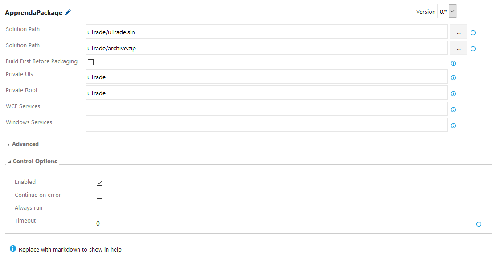
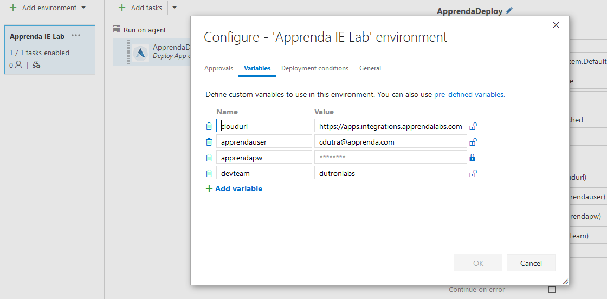

# Apprenda - Visual Studio Services Task Build System Quickstart

## Installation

The Apprenda Build Tools Extension is available in the Visual Studio Team Services Marketplace for installation on Visual Studio Team Services or Team Foundation Server 2015 Update 2 and Team Foundation Server 2017

## Running Builds

_This is for .NET apps only. IF you are using Java or Linux Apps, you must configure this manually. Visit the Apprenda documentation for more details._

Typically here the step you want to execute is "Package App on Apprenda" - which behind the scenes is going to utilize a portable version of the Apprenda Cloud Shell (a.k.a. ACS) to package up the application. A screenshot of how to use this is depicted below.

The fields are as follows:

- **Solution Path** - Use the file chooser to locate the VS Solution File you wish to package.
- **Output Path** -  The full path and file name (use .zip extension) where the package should be written. You will use this later on to publish the release, so keep this value handy.
- **Build First Before Packaging** - This can normally be left unchecked as the build phase is typically done as its own step. Check this box if you _really_ want ACS to build the project for you. 
- **Private UIs** - The projects that should be treated as private UI projects.  ex) -i "SubApp1 PrimaryApp SubApp2" - Specifies PrimaryApp, SubApp1, and SubApp2 as the private UI projects.
- **Private Root** - Specifies the primary private UI project.  ex) -i "SubApp1 PrimaryApp SubApp2" -PrivateRoot PrimaryApp - Specifies PrimaryApp, SubApp1, and SubApp2 as the private UI projects with PrimaryApp as the root UI. When published on Apprenda, the root UI will be accessible at the application's url with virtual applications SubApp1 and SubApp2 underneath it.
- **Services** - The projects that should be treated as WCF service projects.  ex) -s "Service1 Service 2" - Specifies Service1 and Service 2 as the WCF service projects.
- **Windows Services** - The projects that should be treated as Windows service projects.  ex) -ws Service1 "Service 2" - Specifies Service1 and Service 2 as the WCF service projects.

In the advanced category, one parameter is available:
- **Configuration** - This specifies to look for a particular build configuration (Default: Release)

## Running Releases

The best practice here for release management is to use the "Deploy Application to Apprenda". We presume that a package has already been prepared for deployment (by either manual configuration or by the Package Step, specified above).

### Set up your Apprenda Environments

The first piece needed is to configure your environment(s). Typically the best way to do this is to create them, and then choose **Save as Template** so they can be accessed across multiple applications. 

The fields are as follows (NOTE: the name field must match exactly as specified.)

- **cloudurl** - The root url of the cloud instance (ie. https://apps.apprenda.com)
- **apprendauser** - The email address you use to log into Apprenda.
- **apprendapw** - *Note: click the lock to encrypt this field, that way your password will not be stored in plaintext.* 
- **devteam** - Specify which development team you belong to. 

### Set up your Release tasks

Once done, create a new Release Task (find the **Deploy Application to Apprenda** step). Fill in the appropriate values for the task. 

### Application Information

- **Archive Path** - Use the file chooser to locate your .zip file you created in the build step.
- **Application Alias** - This is the application alias, the identifier in apprenda. Lower-case alphanumeric, no spaces.
- **Version Prefix** - This is used to specify what the prefix is for the version. We do this so we can properly increment new versions in a speficied order. (ie. v1, v2, v3, etc.) - default is 'v'.
- **Target Deployment Stage** - (Values:  Definition | Sandbox | Published ) This tells Apprenda which stage you want the new binaries to be deployed to.
- **Force a New Version** - this will signal Apprenda to always create a new version of this application, when possible. The only time this doesn't apply is if the app is on its first version (it will patch itself).

### Connection Information

You can leave these alone, they are going to reference the envrionment variables we set in the previous step.
